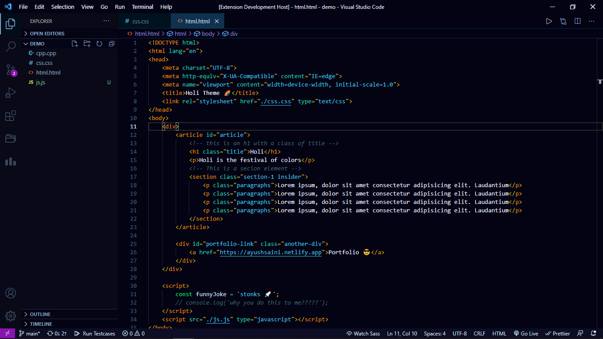

<h1 align="center">
   
    
    
  Holi Theme 🌈
   
   
</h1>

    &nbsp;
    
    

<h3 align="center">A Clean Visual Studio Code dark theme inspired from the Indian festival of colors, Holi</h3>
 
 

## 🎉 Demo 

# 🚀 Installation

1.  Open Visual Studio Code, or first install [VS Code](https://code.visualstudio.com/) if you have not.
2.  Choose **Extensions** from sidebar menu or press `Ctrl + Shift + x`
3.  Search for `Holi Theme`
4.  Click **Install** to install it
5.  Reload Visual Studio Code
6.  From the sidebar menu choose: Manage > Color Theme > **Holi Theme**

## 👋 About
This is my first time creating a theme, so if there's something I've missed (which most probably I've), feel free to file an issue. And If you're already using the Holi Theme, a big thanks to you 😍 for supporting my work. I really means a lot to me.

## 📜 License
Holi Theme is licensed under [MIT License](https://github.com/AyushSaini00/holi-theme/blob/main/LICENSE)